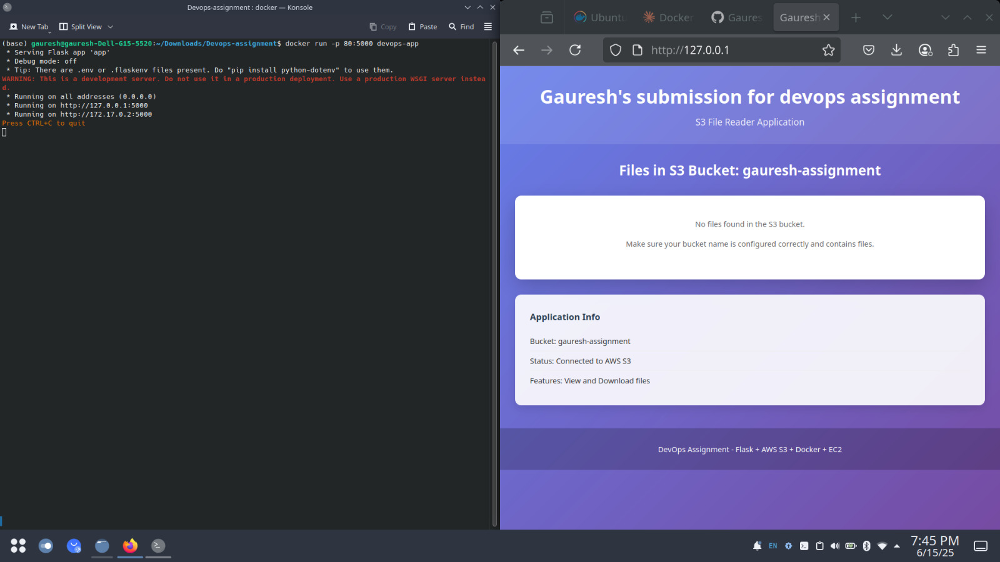
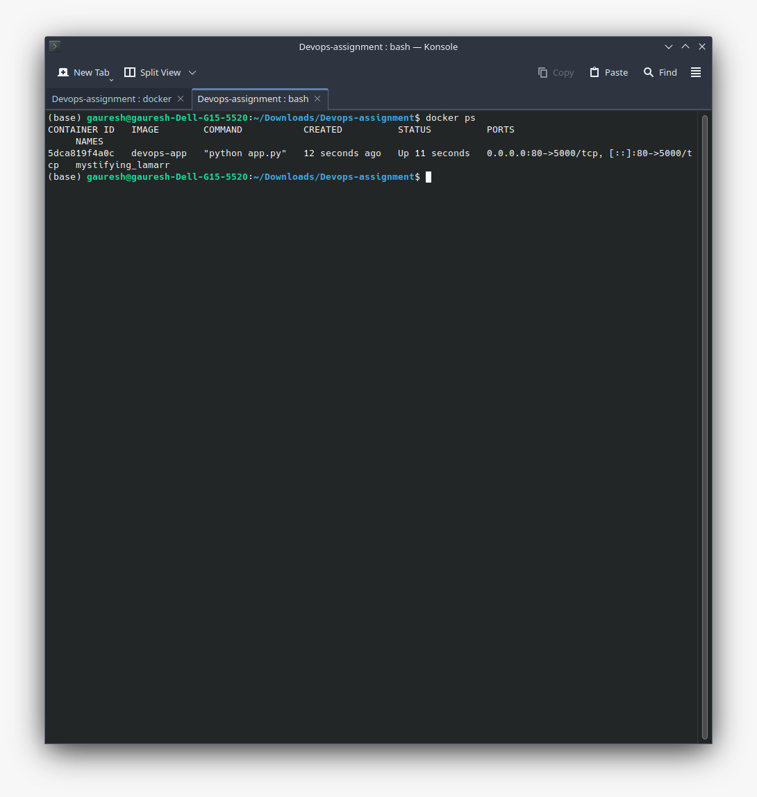
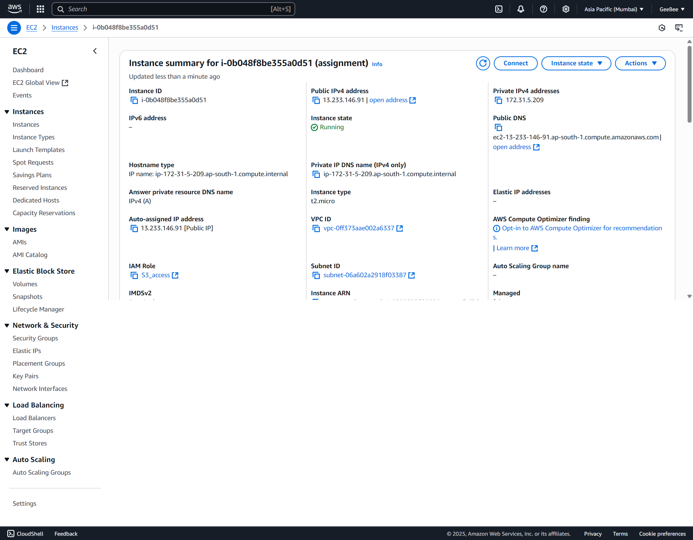
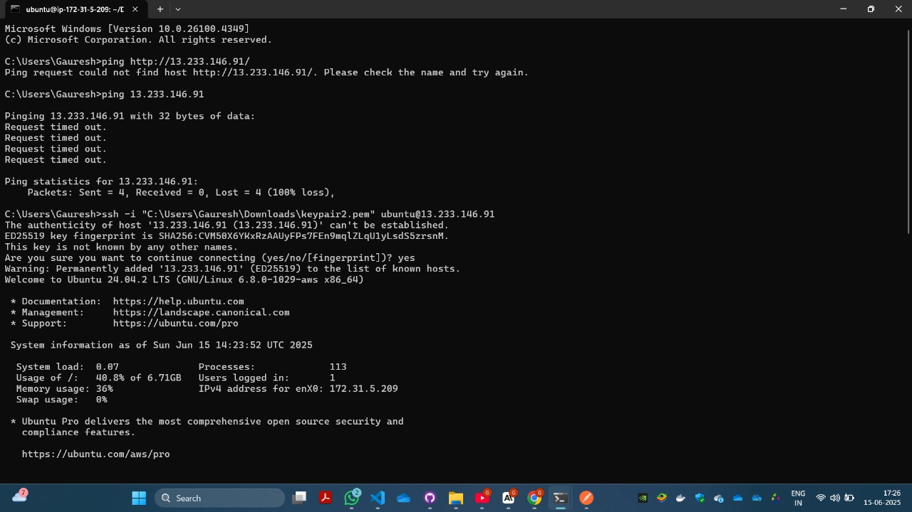
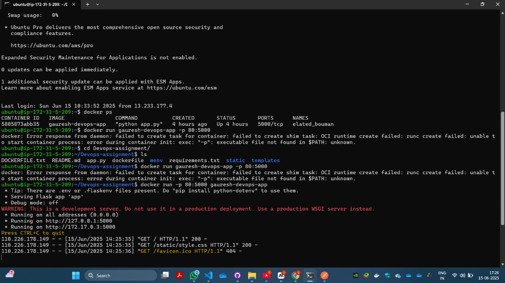
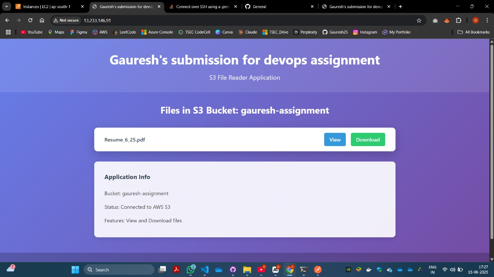

# Devops-assignment
Hey! This is my DevOps intern assignment where I built a Flask app that reads files from AWS S3, containerized it with Docker, and deployed it on EC2.
Live deployed link: http://13.233.146.91/

## What This App Does

It's a simple web application that connects to my S3 bucket and lets you view and download files (currently I have my resume hosted there). The functionality is basic but we can make it easily scalable to add file upload logic and make it a full fledged cloud drive. I went with Flask because it's lightweight and perfect for this kind of project.

## Quick Demo

**Local Testing Screenshot:**
*[Screenshot: App running locally in Docker container - http://localhost:5000 left window: docker container runnning in CLI,right: containerized application locally]*




Note: the S3 access is not alowed in local instance, this is because we use IAM to restrict access

**EC2 Dashboard Screenshot:**
*[Screenshot: AWS EC2 dashboard showing running instance]*




**SSH Terminal Screenshot:**
*[Screenshot: SSH session showing Docker commands and container status]*




**Live App Screenshot:**
*[Screenshot: App running via public EC2 IP address]*



Link: http://13.233.146.91/


Note: the S3 access is enabled in the deployed version via given url, this happens because the EC2 has an attached policy allowing S3 access

**IAM policy**


**Docker Hub**

Link: https://hub.docker.com/r/gbagayatkar/gauresh-devops-app


## How I Built This

### The Setup
1. **Flask App**: Simple web interface that lists S3 files
2. **Docker**: Containerized everything for easy deployment
3. **Docker Hub**: Container registry for storing and distributing the app image
4. **AWS S3**: Storage for my test files
5. **EC2**: Ubuntu server running the containerized app
6. **IAM Roles**: Secure access without hardcoded credentials

### Getting Started Locally

First, clone my repo:
```bash
git clone https://github.com/your-username/gauresh-devops-assignment.git
cd gauresh-devops-assignment
```

Build and run with Docker:
```bash
docker build -t gauresh-devops-app .
docker run -p 80:5000 \
  -e S3_BUCKET_NAME=your-bucket-name \
  -e AWS_ACCESS_KEY_ID=your-key \
  -e AWS_SECRET_ACCESS_KEY=your-secret \
  gauresh-devops-app
```

Alternatively u can pull the container from my DockerHub profile with:
```bash
docker pull gbagayatkar/gauresh-devops-app
```

### AWS Setup

**IAM Role for EC2:**
I have created an IAM role for he EC2 allowing access to the S3 bucket

**S3 setup **
We have created a simple s3 bucket that our application will be able to access and list out all files alloing us to download them

**EC2 setup **
An EC2 instance is used to deploy and run the application over the internet


## The Automation Stuff

### deploy.sh
One-command deployment script that builds, stops old containers, and starts new ones. Makes updates super easy!

### cloud-init.yml  
Automatic server setup - launches EC2 and everything gets configured without touching anything. The instance boots up ready to go.

### docker-compose.yml
For local development - spins up everything with one command. It is cleaner than running multiple docker commands.

## File Structure
```
.
├── app.py              # Main Flask application
├── Dockerfile          # Container setup
├── requirements.txt    # Python packages
├── deploy.sh           # Deployment automation
├── cloud-init.yml      # EC2 auto-configuration
├── docker-compose.yml  # Local development
├── templates/          # HTML templates
├── static/             # CSS styling
└── screenshots/        # Assignment deliverables
```

## Key takeaways

 Using IAM roles instead of hardcoded credentials for improved security
 Using docker-compose instead of docker run allowing for multiple container orchestration in the future
 The automation scripts saves time - instead of running multiple commands every deployment, we have to just run 1 `./deploy.sh` and done.
 Quick deployments in the EC2 instance generation interface via cloud-init


## Environment Variables
- `S3_BUCKET_NAME`: Your S3 bucket name
- `AWS_REGION`: AWS region (I used us-east-1)

## Quick Troubleshooting
- **Can't access app**: Check security groups allow port 80
- **S3 errors**: Verify IAM role is attached to EC2
- **Docker issues**: Make sure user is in docker group

## Challenges faced

-Local issues with docker desktop: I had to face issues while getting docker running on windows this was likely an issue with the gui binaries, 
  Resolution:I could have reinstalled docker gui on my Windows boot, however due to time contraints i preferrred switching over to a Linux environment, I had docker up and running there and i used CLI to setup entirity of the application

## Assignment Deliverables Checklist
- [x] GitHub repository with all code
- [x] Dockerfile for containerization  
- [x] Screenshots of local Docker app
- [x] Screenshots of EC2 dashboard
- [x] Screenshots of SSH terminal session
- [x] Screenshots of app running on public EC2 IP
- [x] Complete documentation

---

**Tech Stack:** Flask, Docker, AWS (S3, EC2, IAM), Ubuntu, Python
